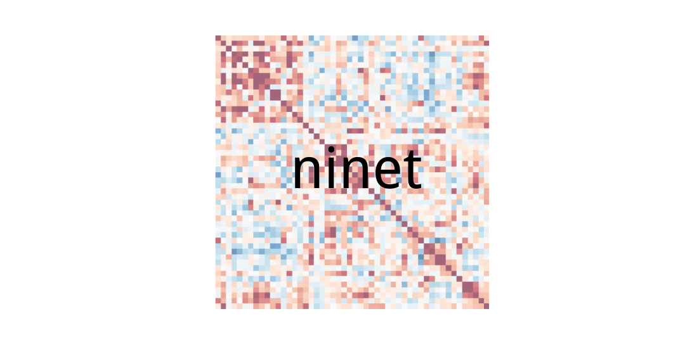

A package of tools for conducting network analysis (and other types analysis) on MRI data. Intended to eventually play nicely with [NetworkX](https://networkx.github.io/), the [epitome](https://github.com/josephdviviano/epitome) pipeline, and replicate at least the base functionality of the [BCT (brain connectivity toolbox)](https://sites.google.com/site/bctnet/) in the Python environment.

**Dependencies**

+ Numpy
+ Scipy
+ Matplotlib
+ Nibabel
+ Scikit Learn

This project is in no way related to the [Israeli-pop rock singer/actress Ninet Tayeb](assets/ninet-not.jpeg).

